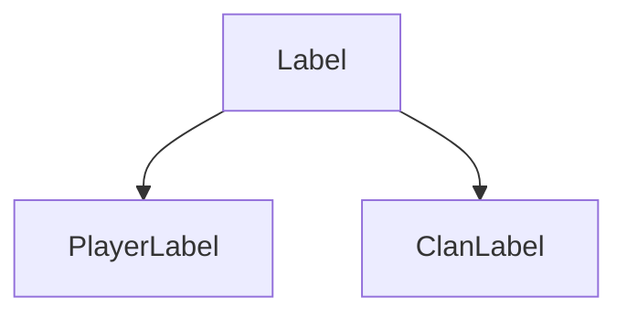
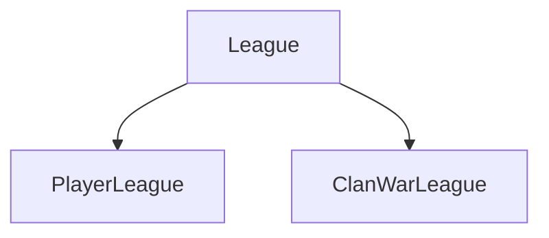

<p align="center">
    <a href="" alt="Status">
        
    </a>
    <a href="" alt="Python">
        
    </a>
</p>

<h1 align="center">coc-api</h1>
<p align="center"><a href="https://developer.clashofclans.com/#/documentation">Clash of Clans API</a> implemented via Python.

## Contents

* [Getting started](#getting-started)
    * [Requirements](#requirements)
    * [Installation](#installation)
* [Usage](#usage)
    * [Basic usage](#basic-usage)
* [General API Documentation](#general-api-documentation)
    * [Models](#models)
        * [BadgeURLs](#badgeurls-model)
        * [Label](#label-model)
        * [League](#league-model)
        * [Location](#location-model)
        * [ClanLabel](#clan-label-model)
        * [ClanWarLeague](#clan-war-league-model)
        * [ClanChatLanguage](#clan-chat-language-model)
    * [Methods](#methods)
    * [Exceptions](#exceptions)
    * [Aliases](#aliases)
* [TODO](#todo)

## Getting started

This API is tested under Python >=3.9.

### Requirements

|Requirement|Version|
|:-----------|-------:|
|attrs|21.4.0|
|cattrs|1.10.0|
|aiohttp|3.8.1|

### Installation

For now, you can install it only from source. This package will be available on PyPi
if code will be good, I think now it is only raw version with raw code.

```
$ git clone https://github.com/bim-ba/coc-api.git
$ cd coc-api
$ pip install -r requirements.txt
```

## Usage

### Basic usage

```python
import asyncio
from client import Client

async def main():
    token = '...' # your token
    coc = Client(token)

    clans = await coc.clans(name='bomb', location='ru', max_members=30)
    print(clans)
    # ['#2P8QU22L2', '#2PPYL9928', '#2PPYL9928', ...]

    clan = await coc.clan(clans[0])
    print(clan.name, clan.location)
    # bomb Location(id=32000193, isCountry=true, name='russia', countryCode='ru')

if __name__ == '__main__':
    asyncio.run(main())
```

## General API documentation

### Models

Models are similar to the original <a href="https://developer.clashofclans.com/#/documentation">Clash of Clans API Models</a>, **but with some changes**. There are some changes in these models due to the fact that I have undertaken a slightly different design of these models in order to simplify and unify them.

All models are immutable, you cant change its contents - only read.

**Changed models**: [Clan](#clan-model)

<h4 id="badgeurls-model">BadgeURLs</h4>

BadgeURLs is used to store small, medium and large image URLs. BadgeURLs for some models may be missing, also a few models can have missing fields. Thats why it is either `str` or `None`.

| Field | Type | Description |
| :---- | :--: | :---------- |
| small | `str` \| `None` | _optional_. Small icon url |
| medium | `str` \| `None` | _optional_. Medium icon url |
| large | `str` \| `None` | _optional_. Large icon url |

<h4 id="label-model">Label</h4>

Label is used to store label id, its name and [iconUrls](#badgeurls-model). This model is just a parent for [PlayerLabel](#player-label-model) and [ClanLabel](#clan-label-model). It will never be created directly.

| Field | Type | Description |
| :---- | :--: | :---------- |
| id | `str` | Field unique id |
| name | `str` | _lowercase_. Field unique name |
| iconUrls | [`BadgeURLs`](#badgeurls-model) \| `None` | _optional_. Field icons, some labels dont have icons |



<h4 id="league-model">League</h4>

League is used to store league id, its name and [iconUrls](#badgeurls-model). There are 2 types of leagues: [playerLeague](#player-league-model) and [clanLeague](#clan-league-model)

| Field | Type | Description |
| :---- | :--: | :---------- |
| id | `str` | Field unique id |
| name | `str` | _lowercase_. Field unique name |
| iconUrls | [`BadgeURLs`](#badgeurls-model) \| `None` | _optional_. Field icons, some leagues dont have icons |



<h4 id="location-model">Location</h4>

Location is used to store location id, its name and country code. Location is not always a country (e.g. International), thats why `isCountry` field is exist and `countryCode` may be `None`.

| Field | Type | Description |
| :---- | :--: | :---------- |
| id | `int` | Location unique id |
| name | `str` | _lowercase_. Location unique name |
| isCountry | `bool` | `True` if location is country |
| countryCode | `str` \| `None` | _optional_. Location country code, may be `None` if location is not country |

<h4 id="clan-label-model">ClanLabel</h4>

Clan label is clan label. See [Label](#label-model).

<h4 id="clan-war-league-model">ClanWarLeague</h4>

Clan war league is war league of clan. See [League](#league-model).

<h4 id="clan-chat-language-model">ClanChatLanguage</h4>

Clan chat language stores information about primary clan chat language.

| Field | Type | Description |
| :---- | :--: | :---------- |
| id | `int` | Language unique id |
| name | `str` | _lowercase_. Language unique name |
| languageCode | `str` | _lowercase_. Language code (like country code) |

<h4 id="clan-war-attack-model">ClanWarAttack</h4>

This model describes information about clan war attack. Every attack has attacker and defender, as for it, this model stores only attacker and defender tags, not full [Player](#player-model) because of recursion.

| Field | Type | Description |
| :---- | :--: | :---------- |
| attackerTag | `str` | Attacker tag |
| defenderTag | `str` | Defender tag |
| stars | `int` | How many stars attacker obtain |
| destructionPercentage | `float` | Destruction percentage in range 0.0 to 100% |
| order | `int` | Map position where attacked base is located |
| duration | [`datetime.timedelta`](https://docs.python.org/3/library/datetime.html#timedelta-objects) | <span id="pendulum-duration">how long did the attack last (pendulum may be good here)</span> |

<h4 id="clan-war-player-model">ClanWarPlayer</h4>

This model describes information about player in current clan war and his attacks (if made).

| Field | Type | Description |
| :---- | :--: | :---------- |
| tag | `str` | Player tag |
| mapPosition | `int` | Player map position |
| opponentAttacks | `int` | It seems to be `len(self.attacks)` |
| attacks | <code>list[[ClanWarAttack](#clan-war-attack-model)]</code> \| `None` | _optional_. Attacks against opponents, may be `None` if no were made |
| bestOpponentAttack | <code>[ClanWarAttack](#clan-war-attack-model)</code> \| `None` | _optional_. Best attack in `self.attacks`, based on stars and destruction percentage, may be `None` if no were made |

## TODO

- [ ] `tests.py`
- [ ] Testing under _Python <=3.9_
- [ ] Models fields must corresponds to _snake_case_ syntax
- [ ] Pendulum instead of standard datetime (is it worth it?)
    - [duration problem](#pendulum-duration)
- [ ] Comparable [Location](#location-model) and [ClanChatLanguage](#clan-chat-language-model)
- [ ] Comparable [Player](#player-model) and [ClanWarPlayer](#clan-war-player-model)