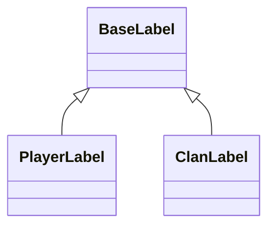
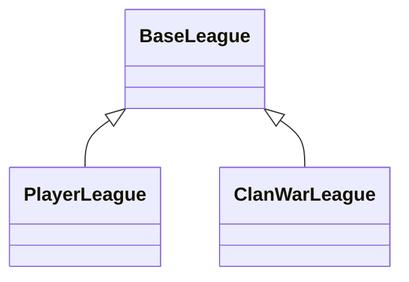

<p align="center">
    <a href="" alt="Python">
        
    </a>
    <a>
        
    </a>
    <br/>
    <a href="" alt="Contributions">
        
    </a>
</p>

<h1 align="center">coc-api</h1>
<p align="center">Asynchronous wrapper around <a href="https://developer.clashofclans.com/#/documentation">Clash of Clans API</a>.

# Getting started

## Basic usage

```py
import asyncio

from cocapi import Client

async def main():
    client = Client('TOKEN') # your token

    clans = await client.clans(name='bomb', location='ru', max_members=30)
    print(clans)
    # ['#2P8QU22L2', '#2PPYL9928', '#22GLLRQYY', ...]

    first_clan, second_clan, third_clan = await asyncio.gather(
        client.clan(clans[0]),
        client.clan(clans[1]),
        client.clan(clans[2])
    )

    print(first_clan.name, first_clan.location)
    # bomb Location(id=32000193, isCountry=true, name='russia', countryCode='ru')

    print(second_clan.required_trophies, second_clan.required_townhall_level)
    # 200 3

    print(third_clan.description)
    # просто клан 12+ без матов ну и всё

if __name__ == '__main__':
    asyncio.run(main())
```

## Installation

For now, you can install it only from source. This package will be available on PyPi
as soon as code will be good and there will be no errors, I think now it is only a raw version. For the main branch I am using a [poetry](https://python-poetry.org/) to manage the packages, but you can use whatever you want (there are `requirements.txt` and `dev-requirements.txt` for backward comatibility).

```shell
git clone https://github.com/bim-ba/coc-api.git
cd coc-api
poetry install --no-dev
```

If you want to contribute, you need to install some dev packages.

```shell
poetry install
```

## Dependencies

| Requirement | Version |
| :---------- | :------ |
| aiohttp | ^3.8.1 |
| dacite | ^1.6.0 |
| pyhumps | ^3.5.3 |
| pytest | _dev_. ^7.1.1 |
| pytest-asyncio | _dev_. ^0.18.3 |
| black | _dev_. ^22.3.0 |

# Contents

* [Getting started](#getting-started)
  * [Basic usage](#basic-usage)
  * [Installation](#installation)
  * [Dependencies](#dependencies)
* [General API Documentation](#general-api-documentation)
  * [Methods](#methods)
    * [clans](#method-clans)
    * [clan](#method-clan)
    * [player](#method-player)
    * [clan_rankings](#method-clan-rankings)
    * [player_rankings](#method-player-rankings)
    * [clan_versus_rankings](#method-clan-versus-rankings)
    * [player_versus_rankings](#method-player-versus-rankings)
    * [goldpass](#method-goldpass)
    * [all_locations](#method-all-locations)
    * [get_location](#method-get-location)
    * [all_clan_labels](#method-all-clan-labels)
    * [get_clan_label](#method-get-clan-label)
    * [all_clan_leagues](#method-all-clan-leagues)
    * [get_clan_league](#method-get-clan-league)
    * [all_player_labels](#method-all-player-labels)
    * [get_player_label](#method-get-player-label)
    * [all_player_leagues](#method-all-player-leagues)
    * [get_player_league](#method-get-player-league)
    * [login](#method-login)
    * [list_keys](#method-list-keys)
    * [create_key](#method-create-key)
    * [revoke_key](#method-revoke-key)
  * [Models](#models)
    * [Label](#label-model)
    * [League](#league-model)
    * [Location](#location-model)
    * [BadgeURLs](#badgeurls-model)
    * [Player](#player-model)
    * [PlayerLabel](#player-label-model)
    * [PlayerLeague](#player-league-model)
    * [PlayerAchievment](#player-achievment-model)
    * [PlayerTroop](#player-troop-model)
    * [Clan](#clan-model)
    * [ClanWar](#clan-war-model)
    * [ClanLabel](#clan-label-model)
    * [ClanWarInfo](#clan-war-info-model)
    * [ClanWarAttack](#clan-war-attack-model)
    * [ClanWarLeague](#clan-war-league-model)
    * [ClanWarPlayer](#clan-war-player-model)
    * [ClanWarResult](#clan-war-result-model)
    * [ClanWarInfoClan](#clan-war-info-clan-model)
    * [ClanChatLanguage](#clan-chat-language-model)
    * [GoldPass](#goldpass-model)
    * [Key](#key-model)
  * [Exceptions](#exceptions)
    * [ClientRequestError](#exception-client-request-error)
    * [JSONContentTypeError](#exception-json-content-type-error)
    * [UnknownLocationError](#exception-unknown-location-error)
    * [UnknownClanLabelError](#exception-unknown-clan-label-error)
  * [Aliases](#aliases)
    * [Tag](#alias-tag)
    * [ClanType](#alias-clan-type)
    * [ClanRole](#alias-clan-role)
    * [ClanWarFrequency](#alias-clan-war-frequency)
    * [ClanWarPreference](#alias-clan-war-preference)
    * [ClanWarResultL](#alias-clan-war-result-l)
    * [ClanWarState](#alias-clan-war-state)
    * [Village](#alias-village)
* [API Completness](#api-completness)
* [TODO](#todo)

# General API documentation

## Methods

<h3 id="method-clans"><code>clans</code></h3>

**At least one filtering criteria must be used**  
Use this method to query all clans by name and/or filtering the results using various criteria. If name is used as part of search, it is required to be at least three characters long. It is not possible to specify ordering for results so clients should not rely on any specific ordering as that may change in the future releases of the [API](https://developer.clashofclans.com/#/documentation).

Normally, method makes 1 request , but there are some exclusions:  

* If `location` parameter is not `None`, method can make 1 additional request in order to convert location name to its id.  
* If `labels` parameter is not `None`, method can make 1 additional request in order to convert label/labels name to its id/ids.

_So the maximum number of request this method can make is 3_

Returns list of clan tags.

| Parameter | Type | Description |
| :-------- | :--: | :---------- |
| name | `str` | _optional_. Clan name. Must be at least 3 characters long |
| min_members | `int` | _optional_. Minimum clan members |
| max_members | `int` | _optional_. Maximum clan members |
| min_clan_points | `int` | _optional_. Minimum clan points |
| min_clan_level | `int` | _optional_. Minimum clan level |
| war_frequency | `str` | _optional_. [Clan war frequency](#alias-clan-war-frequency) |
| location | `str` | _optional_. Clan location. May be either country code or full location name (_e.g. Russia == RU_) |
| labels | `str` \| `list[str]` | _optional_. Clan label or labels |

Examples:

```py
>>> clans = await client.clans(location='ru', war_frequency='never')
>>> print(clans)
# ['#RLU20URV', '#RV9RCQV', '#2LVV8RCJJ', ...]
```

<h3 id="method-clan"><code>clan</code></h3>

Get information about a single clan by clan tag.

Normally, method makes 1 request, but there are some exclusions:  

* If clan war log is public, method makes 2 additional requests to gather information about clan war state and clan war log.

Returns [Clan](#clan-model) model.

| Parameter | Type | Description |
| :-------- | :--: | :---------- |
| tag | `str` | _required_. Clan tag |

Examples:

```py
>>> clan = await client.clan('#2P8QU22L2')
>>> print(clan.name, clan.location)
# bomb Location(id=32000193, isCountry=true, name='russia', countryCode='ru')
```

<h3 id="method-player"><code>player</code></h3>

Get information about a single player by player tag.

Returns [Player](#player-model) model.

| Parameter | Type | Description |
| :-------- | :--: | :---------- |
| tag | `str` | _required_. Player tag |

Examples:

```py
>>> player = await client.player('#LJJOUY2U8')
>>> print(player.name)
# bone_appettit
```

<h3 id="method-clan-rankings"><code>clan_rankings</code></h3>

Get clan rankings for a specific location.

Normally, this method makes 1 request, but there is some exclusion:

* Method can make 1 additional request in order to convert location name to its id.

Returns list of clan tags.

| Parameter | Type | Description |
| :-------- | :--: | :---------- |
| location | `str` | _required_. Location name or country code |

Examples:

```py
>>> clans = await client.clan_rankings('ru')
>>> print(clans[0])
# TODO: ...
```

<h3 id="method-player-rankings"><code>player_rankings</code></h3>

Get player rankings for a specific location.

Normally, this method makes 1 request, but there is some exclusion:

* Method can make 1 additional request in order to convert location name to its id.

Returns list of player tags.

| Parameter | Type | Description |
| :-------- | :--: | :---------- |
| location | `str` | _required_. Location name or country code |

Examples:

```py
>>> players = await client.player_rankings('ru')
>>> print(players[0])
# TODO: ...
```

<h3 id="method-clan-versus-rankings"><code>clan_versus_rankings</code></h3>

Get clan versus rankings for a specific location.

Normally, this method makes 1 request, but there is some exclusion:

* Method can make 1 additional request in order to convert location name to its id.

Returns list of clan tags.

| Parameter | Type | Description |
| :-------- | :--: | :---------- |
| location | `str` | _required_. Location name or country code |

Examples:

```py
>>> clans = await client.clan_versus_rankings('ru')
>>> print(clans[0])
# TODO: ...
```

<h3 id="method-player-versus-rankings"><code>player_versus_rankings</code></h3>

Get player versus rankings for a specific location.

Normally, this method makes 1 request, but there is some exclusion:

* Method can make 1 additional request in order to convert location name to its id.

Returns list of player tags.

| Parameter | Type | Description |
| :-------- | :--: | :---------- |
| location | `str` | _required_. Location name or country code |

Examples:

```py
>>> players = await client.player_versus_rankings('ru')
>>> print(players[0])
# TODO: ...
```

<h3 id="method-goldpass"><code>goldpass</code></h3>

Get information about the current gold pass season.

Returns [GoldPass](#goldpass-model) model.

Examples:

```py
>>> goldpass = await client.goldpass()
>>> print(goldpass.startTime)
# TODO: ...
```

<h3 id="method-all-locations"><code>all_locations</code></h3>

List locations.

Returns dictionary with `key`: `value` pairs like `LocationName` | `Country Code`: [`Location`](#location-model).

Examples:

```py
>>> locations = await client.all_locations()
>>> assert locations['ru'] == locations['russia']
>>> print(locations['ru']) # not recommended, use ``client.get_location`` instead
# TODO: Location(...)
```

<h3 id="method-get-location"><code>get_location</code></h3>

Get location information.

Returns [Location](#location-model) model.

| Parameter | Type | Description |
| :-------- | :--: | :---------- |
| location_name | `str` | _required_. Location name or country code |

Examples:

```py
>>> location1 = await client.get_location('rU')
>>> location2 = await client.get_location('ruSSia')
>>> assert location1.id == location2.id

>>> location3 = await client.get_location('kenya')
>>> print(location3.id, location3.country_code)
# TODO: ...
```

<h3 id="method-all-clan-labels"><code>all_clan_labels</code></h3>

List clan labels.

Returns dictionary with `key`: `value` pairs like `str`: [`ClanLabel`](#clan-label-model).

Examples:

```py
>>> labels = await client.all_clan_labels()
>>> print(labels['clan wars']) # not recommended, use ``client.get_clan_label`` instead
# TODO: ClanLabel(...)
```

<h3 id="method-get-clan-label"><code>get_clan_label</code></h3>

Get clan label information.

Returns [ClanLabel](#clan-label-model) model.

| Parameter | Type | Description |
| :-------- | :--: | :---------- |
| label_name | `str` | _required_. Label name |

Examples:

```py
>>> label = await client.get_clan_label('clAn Wars')
>>> print(label.id, label.name)
# TODO: ...
```

<h3 id="method-all-clan-leagues"><code>all_clan_leagues</code></h3>

List clan leagues.

Returns dictionary with `key`: `value` pairs like `str`: [`ClanLeague`](#clan-league-model).

Examples:

```py
>>> leagues = await client.all_clan_leagues()
>>> print(leagues['international']) # not recommended, use ``client.get_clan_league`` instead
# TODO: League(...)
```

<h3 id="method-get-clan-league"><code>get_clan_league</code></h3>

Get information about clan league.

Returns [ClanLeague](#clan-league-model) model.

| Parameter | Type | Description |
| :-------- | :--: | :---------- |
| league_name | `str` | _required_. League name |

Examples:

```py
>>> league = await client.get_clan_league('international')
>>> print(league.id, league.name)
# TODO: ...
```

<h3 id="method-all-player-labels"><code>all_player_labels</code></h3>

List player labels.

Returns dictionary with `key`: `value` pairs like `str`: [`PlayerLabel`](#player-label-model).

Examples:

```py
>>> labels = await client.all_player_labels()
>>> print(labels['...']) # not recommended, use ``client.get_player_label`` instead
# TODO: PlayerLabel(...)
```

<h3 id="method-get-player-label"><code>get_player_label</code></h3>

Get player label information.

Returns [PlayerLabel](#player-label-model) model.

| Parameter | Type | Description |
| :-------- | :--: | :---------- |
| label_name | `str` | _required_. Label name |

Examples:

```py
>>> label = await client.get_player_label('...')
>>> print(label.id, label.name)
# TODO: ...
```

<h3 id="method-all-player-leagues"><code>all_player_leagues</code></h3>

List player leagues.

Returns dictionary with `key`: `value` pairs like `str`: [`PlayerLeague`](#player-league-model).

Examples:

```py
>>> leagues = await client.all_player_leagues()
>>> print(leagues['...']) # not recommended, use ``client.get_player_league`` instead
# TODO: League(...)
```

<h3 id="method-get-player-league"><code>get_player_league</code></h3>

Get information about player league.

Returns [PlayerLeague](#player-league-model) model.

| Parameter | Type | Description |
| :-------- | :--: | :---------- |
| league_name | `str` | _required_. League name |

Examples:

```py
>>> league = await client.get_player_league('...')
>>> print(league.id, league.name)
# TODO: ...
```

<h3 id="method-login"><code>login</code></h3>

Log into account using credentials that have been provided while initialization.

Examples:

```py
>>> await client.login()
```

<h3 id="method-list-keys"><code>list_keys</code></h3>

List all keys that your account have.

Returns list of [Key](#key-model) models.

Examples:

```py
>>> keys = await client.list_keys()
# TODO: ...
```

<h3 id="method-create-key"><code>create_key</code></h3>

Create new API key in your account.

Returns [Key](#key-model) model.

| Parameter | Type | Description |
| :-------- | :--: | :---------- |
| key_name | `str` | _required_. Key name |
| key_description | `str` | _optional_. Key description |
| allowed_ips | `List[str]` | _required_. List of allowed ips, for which this key is intended |

Examples:

```py
>>> key = await client.create_key(key_name='dababy', allowed_ips=['8.8.8.8'])
>>> print(key.token)
# TODO: ...
```

<h3 id="method-revoke-key"><code>revoke_key</code></h3>

Removes already created API key in your account.

| Parameter | Type | Description |
| :-------- | :--: | :---------- |
| key_id | `int` | _required_. Key id |

Examples:

```py
>>> await client.revoke_key('xxxxxxxx-xxxx-xxxx-xxxx-xxxxxxxxxxxx')
# TODO: ...
```

## Models

Models are corresponds to the original [Clash of Clans API Models](https://developer.clashofclans.com/#/documentation), **but with some changes**. I have made small of these models (comparing them to the original ones) due to the fact that I have undertaken a slightly different design of these models in order to simplify and unify them.  
**In code all models are readonly, you cant change its contents - only read.**

<h3 id="baselabel-model"><code>Base Label</code></h3>

This model stores information about label id, name and [icon_urls](#badgeurls-model). This model is just a parent for [PlayerLabel](#player-label-model) and [ClanLabel](#clan-label-model). It will never be created directly.

| Field | Type | Description |
| :---- | :--: | :---------- |
| id | `str` | Field unique id |
| name | `str` | _case insensitive_. Field unique name |
| icon_urls | [`BadgeURLs`](#badgeurls-model) \| `None` | _optional_. Field icons, some labels dont have icons. `None` if label does not have icons |



<h3 id="baseleague-model"><code>Base League</code></h3>

This model stores information about league id, its name and [icon_urls](#badgeurls-model). There are 2 types of leagues: [playerLeague](#player-league-model) and [clanLeague](#clan-league-model)

| Field | Type | Description |
| :---- | :--: | :---------- |
| id | `str` | Field unique id |
| name | `str` | _case insensitive_. Field unique name |
| icon_urls | [`BadgeURLs`](#badgeurls-model) \| `None` | _optional_. Field icons, some leagues dont have icons. `None` if league does not have icons |



<h3 id="location-model"><code>Location</code></h3>

This model stores information about location id, its name and country code. Location is not always a country (e.g. _International_), thats why `is_country` field is exist and `country_code` may be `None`.

| Field | Type | Description |
| :---- | :--: | :---------- |
| id | `int` | Location unique id |
| name | `str` | _case insensitive_. Location unique name |
| is_country | `bool` | `True` if location is country |
| country_code | `str` \| `None` | _optional_. Location country code. `None` if location is not country |

<h3 id="badgeurls-model"><code>BadgeURLs</code></h3>

This model stores information about small, medium and large image urls. Urls for some models may be missing, also a few models can have missing fields, thats why it is either `str` or `None`.

| Field | Type | Description |
| :---- | :--: | :---------- |
| small | `str` \| `None` | _optional_. Small icon url. `None` if missing |
| medium | `str` \| `None` | _optional_. Medium icon url. `None` if missing |
| large | `str` \| `None` | _optional_. Large icon url. `None` if missing |

<h3 id="player-model"><code>Player</code></h3>

This model describes all information about player.

| Field | Type | Description |
| :---- | :--: | :---------- |
| tag | `str` | Player unique tag |
| name | `str` | Player name |
| town_hall_level | `int` | Player townhall level |
| builder_hall_level | `int` | Player builder hall level |
| exp_level | `int` | Player experience |
| trophies | `int` | Player trophies |
| best_trophies | `int` | Player best trophies |
| war_stars | `int` | Player summary war stars |
| attack_wins | `int` | Player summary attack wins |
| defense_wins | `int` | Player summary defense wins |
| versus_trophies | `int` | Player versus trophies (builder base) |
| best_versus_trophies | `int` | Player best versus trophies (builder base) |
| versus_battle_wins | `int` | Player summary versus battle wins |
| donations | `int` | Player summary donations |
| donations_received | `int` | Player summary donations received |
| troops | <code>list[[PlayerTroop](#player-troop-model)]</code> | Player troops leveling |
| heroes | <code>list[[PlayerTroop](#player-troop-model)]</code> | Player heroes leveling |
| spells | <code>list[[PlayerTroop](#player-troop-model)]</code> | Player spells leveling |
| league | [`PlayerLeague`](#player-league-model) \| `None` | _optional_. Player league. `None` if player does not have league |
| clan | `str` \| `None` | _optional_. Clan tag. It is not [Clan](#clan-model) due to recursion and object weight. `None` if player does not have clan |
| role | `str` \| `None` | _optional_. [Player role in clan](#alias-clan-role). `None` if player does not have clan |
| war_preference | `str` \| `None` | _optional_. [Player war preference](#alias-clan-war-preference). `None` if player does not specify it |
| town_hall_weapon_level | `int` \| `None` | _optional_. Player town hall weapon level (it is unlocked for player from 13 townhall level). `None` if player town hall is less than 13 |

<h3 id="player-label-model"><code>PlayerLabel</code></h3>

Inherited from [Label](#label-model).  
This model describes player label information.

<h3 id="player-league-model"><code>PlayerLeague</code></h3>

Inherited from [League](#league-model).  
This model describes player league information.

<h3 id="player-achievment-model"><code>PlayerAchievment</code></h3>

This model describes information about some player achievment.

| Field | Type | Description |
| :---- | :--: | :---------- |
| name | `str` | Achievment name |
| stars | `int` | How many stars player have in this achievment |
| value | `int` | Progress |
| target | `int` | How much is needed to go to the next star |
| info | `str` | Detailed information about this achievment |
| village | `str` | In what [village](#alias-village) it achievment can obtained be |
| completion_info | `str` \| `None` | _optional_. Completion info. `None` if ... #TODO |

<h3 id="player-troop-model"><code>PlayerTroop</code></h3>

This model describes information about player troops leveling (troops/spells/heroes). **This is not describes cuurent troops in player army camp, this describes troops leveling.**

| Field | Type | Description |
| :---- | :--: | :---------- |
| name | `str` | Troop name |
| level | `int` | Troop level |
| max_level | `int` | Max troop level to which it can be upgraded |
| village | `str` | Which [village](#alias-village) this warrior belongs to |
| super_troop_is_active | `bool` \| `None` | _optional_. `True` if player activated _Super Troop Potion_. `None` if troop can not be _Super_ (spells and heroes can not be in _super form also_) |

<h3 id="clan-model"><code>Clan</code></h3>

This model describes all information about clan.

| Field | Type | Description |
| :---- | :--: | :---------- |
| tag | `str` | Clan unique tag |
| name | `str` | Clan name |
| type | `str` | [Clan type](#alias-clan-type) |
| description | `str` | Clan description |
| badge_urls | [`BadgeURLs`](#badgeurls-model) | Clan icon urls |
| required_trophies | `int` | Required trophies to join this clan |
| required_versus_trophies | `int` | Required versus trophies (builder base) to join this clan |
| required_townhall_level | `int` | Required town hall level to join this clan |
| labels | <code>list[[ClanLabel](#clan-label-model)]</code> | List of clan labels |
| level | `int` | Clan level |
| points | `int` | Clan points |
| versus_points | `int` | Clan versus points |
| member_list | `list[str]` | List of tags of clan members |
| war | [`ClanWar`](#clan-war-model) | Information about war |
| location | [`Location`](#location-model) \| `None` | _optional_. Information about clan location. `None` if clan did not specify it |
| chat_language | [`ClanChatLanguage`](#clan-chat-language-model) \| `None` | _optional_. Information about clan chat primary language. `None` if clan did not specify it |

<h3 id="clan-war-model"><code>ClanWar</code></h3>

This model describes all summary information about clan war state. If `is_war_log_public` is `False` you can not access current war information (including state) and war log.

| Field | Type | Description |
| :---- | :--: | :---------- |
| wins | `int` | How many times clan has won wars |
| losses | `int` | How many times clan has lost wars |
| ties | `int` | How many times clan has played a draw in wars |
| winstreak | `int` | War winstreak |
| is_war_log_public | `bool` | `True` if clan war log is public |
| frequency | `str` | [Clan war frequency](#alias-clan-war-frequency) preference |
| state | [`ClanWarState`](#clan-war-state-model) \| `None` | _optional_. Current war state. `None` if `is_war_log_public` is `False` |
| currentwar | [`ClanWarInfo`](#clan-war-info-model) \| `None` | _optional_. Information about current war. `None` if `is_war_log_public` is `False` |
| log | [`ClanWarResult`](#clan-war-result-model) \| `None` | _optional_. War log. `None` if `is_war_log_public` is `False` |

<h3 id="clan-label-model"><code>ClanLabel</code></h3>

Inherited from [BaseLabel](#baselabel-model).  
Clan label is clan label.

<h3 id="clan-war-info-model"><code>ClanWarInfo</code></h3>

This model describes information about current war.

| Field | Type | Description |
| :---- | :--: | :---------- |
| clan | [`ClanWarInfoClan`](#clan-war-info-clan-model) | Current war information about this clan |
| opponent | [`ClanWarInfoClan`](#clan-war-info-clan-model) | Current war information about opponent clan |
| start_time | [`datetime.datetime`](https://docs.python.org/3/library/datetime.html#datetime-objects) \| `None` | _optional_. Current war start time (UTC). `None` if ... #TODO <br/> _pendulum may be good here_ |
| end_time | [`datetime.datetime`](https://docs.python.org/3/library/datetime.html#datetime-objects) \| `None` | _optional_. Current war end time (UTC). `None` if ... #TODO <br/> _pendulum may be good here_ |
| preparation_start_time | [`datetime.datetime`](https://docs.python.org/3/library/datetime.html#datetime-objects) \| `None` | _optional_. Current war preparation start time (UTC). `None` if ... #TODO <br/> _pendulum may be good here_ |
| team_size | `int` \| `None` | _optional_. Clan team size in current war. `None` if ... #TODO |
| attacks_per_member | `int` \| `None` | _optional_. How many attacks one member can perform. `None` if ... #TODO |

<h3 id="clan-war-attack-model"><code>ClanWarAttack</code></h3>

This model describes information about clan war attack. Every attack has attacker and defender, as for it, this model stores only attacker and defender tags, not full [Player](#player-model) because of recursion.

| Field | Type | Description |
| :---- | :--: | :---------- |
| attacker_tag | `str` | Attacker tag |
| defender_tag | `str` | Defender tag |
| stars | `int` | How many stars attacker obtain |
| destruction_percentage | `float` | Destruction percentage in range 0.0 to 100.0% |
| order | `int` | Map position where attacked base is located |
| duration | [`datetime.timedelta`](https://docs.python.org/3/library/datetime.html#timedelta-objects) | How long did the attack last <br/> _pendulum may be good here_ |

<h3 id="clan-war-league-model"><code>ClanWarLeague</code></h3>

Inherited from [BaseLeague](#baseleague-model).  
Clan war league is war league of clan.

<h3 id="clan-war-player-model"><code>ClanWarPlayer</code></h3>

This model describes information about player in current clan war and his attacks (if made).

| Field | Type | Description |
| :---- | :--: | :---------- |
| tag | `str` | Player tag |
| map_position | `int` | Player map position |
| opponent_attacks | `int` | Available opponent attacks |
| attacks | <code>list[[ClanWarAttack](#clan-war-attack-model)]</code> \| `None` | _optional_. Attacks against opponents. `None` if no were made |
| best_opponent_attack | [`ClanWarAttack`](#clan-war-attack-model) \| `None` | _optional_. Best attack in `attacks`. `None` if no were made |

<h3 id="clan-war-result-model"><code>ClanWarResult</code></h3>

This model describes result of clan war. Used in clan war logs.

| Field | Type | Description |
| :---- | :--: | :---------- |
| result | `str` | [War result](#alias-clan-war-result-l) |
| end_time | [`datetime.datetime`](https://docs.python.org/3/library/datetime.html#datetime-objects) | When this war is ended (UTC). <br/> _pendulum may be good here_ |
| team_size | `int` | War team size |
| attacks_per_member | `int` | How many attacks one member could make |
| clan | [`ClanWarInfoClan`](#clan-war-info-clan-model) | War information about this clan |
| opponent | [`ClanWarInfoClan`](#clan-war-info-clan-model) | War information about opponent clan |

<h3 id="clan-war-info-clan-model"><code>ClanWarInfoClan</code></h3>

This model describes information about some clan in war.

| Field | Type | Description |
| :---- | :--: | :---------- |
| clan_level | `int` | Clan level |
| stars | `int` | Total stars received |
| destruction_percentage | `float` | Total destruction percentage |
| attacks | `int` \| `None` | _optional_. Total maded attacks. `None` if no were made |
| members | [`ClanWarPlayer`](#clan-war-player-model) \| `None` | _optional_. Participating clan members in war. `None` if there are no such |

<h3 id="clan-chat-language-model"><code>ClanChatLanguage</code></h3>

Clan chat language stores information about primary clan chat language.

| Field | Type | Description |
| :---- | :--: | :---------- |
| id | `int` | Language unique id |
| name | `str` | _case insensitive_. Language unique name |
| language_code | `str` | _case insensitive_. Language code (like country code) |

<h3 id="goldpass-model"><code>GoldPass</code></h3>

This model describes information about current gold pass.

| Field | Type | Description |
| :---- | :--: | :---------- |
| start_time | [`datetime.datetime`](https://docs.python.org/3/library/datetime.html#datetime-objects) | Current season start time (UTC) <br/> _pendulum may be good here_ |
| end_time | [`datetime.datetime`](https://docs.python.org/3/library/datetime.html#datetime-objects) | Current season end time (UTC) <br/> _pendulum may be good here_ |

<h3 id="key-model"><code>Key</code></h3>

This model describes information about API key.

| Field | Type | Description |
| :---- | :--: | :---------- |
| id | `int` | Id |
| name | `str` | Name |
| description | `str` \| `None` | Description |
| allowance | `list[str]` | Allowed ips, for which this key is intended |
| token | `str` | Token |

## Exceptions

<h3 id="client-request-error"><code>ClientRequestError</code></h3>

Raises while something went wrong while making request.

| Field | Type | Description |
| :---- | :--: | :---------- |
| response | `aiohttp.ClientResponse` | Response from server |
| message | <details><summary>`str`</summary>````'Error while making request! Server returned {status_code} for {url}.'````</details> | _can be supplemented_. Detailed message on whats going on |

<h3 id="exception-json-content-type-error"><code>JSONContentTypeError</code></h3>

Raises while fetching some resource with content that cannot be decoded into JSON.

| Field | Type | Description |
| :---- | :--: | :---------- |
| content_type | `str` | Resource content type |
| message | <details><summary>`str`</summary>````'aiohttp throws an error while decoding JSON from the request! Content type was {content_type}: {error}'````</details> | _constant_. Detailed message on whats going on |

<h3 id="exception-unknown-location-error"><code>UnknownLocationError</code></h3>

Raises when you trying to pass unknown location to function parameters.

| Field | Type | Description |
| :---- | :--: | :---------- |
| location | `Any` | What did you pass |
| message | <details><summary>`str`</summary>````'Unknown location! To get available locations, check `self._locations` or official API reference https://developer.clashofclans.com/#/documentation for "locations/locations" block'````</details> | _constant_. Detailed message on whats going on |

<h3 id="exception-unknown-clan-label-error"><code>UnknownClanLabelError</code></h3>

Raises when you trying to pass unknown clan label to function parameters.

| Field | Type | Description |
| :---- | :--: | :---------- |
| label | `Any` | What did you pass |
| message | <details><summary>`str`</summary>````'Unknown clan label! To get available clan labels, check `self._locations` or official API reference https://developer.clashofclans.com/#/documentation for "locations/locations" block'````</details> | _constant_. Detailed message on whats going on |

## Aliases

<h3 id="alias-tag"><code>Tag</code></h3>

Represents clan tag or player tag.  
Starts with _#_, may have only digits and capital letters, length in range 1 to 9 (except _#_ symbol) _<-- unverified_  
Equivalent to `str`.

Must match `r'#[1-9A-Z]{1,9}'` regex, but in fact there is no check.

```py
Tag = str
```

<h3 id="alias-clan-type"><code>ClanType</code></h3>

_constant_. Represents clan type.  

```py
ClanType = 'open' | 'closed' | 'inviteOnly'
```

<h3 id="alias-clan-role"><code>ClanRole</code></h3>

_constant_. Represents player clan role.  

```py
ClanRole = 'leader' | 'coLeader' | 'admin' | 'member'
```

<h3 id="alias-clan-war-frequency"><code>ClanWarFrequency</code></h3>

_constant_. Represents clan war frequency.

```py
ClanWarFrequency = 'always' | 'moreThanOncePerWeek' | 'oncePerWeek' | 'lessThanOncePerWeek' | 'never' | 'unknown'
```

<h3 id="alias-clan-war-preference"><code>ClanWarPreference</code></h3>

_constant_. Represents clan war preference.

```py
ClanWarPreference = 'in' | 'out'
```

<h3 id="alias-clan-war-result-l"><code>ClanWarResultL</code></h3>

_constant_. Represents clan war result.

```py
ClanWarResultL = 'win' | 'lost' | 'tie'
```

<h3 id="alias-clan-war-state"><code>ClanWarState</code></h3>

_constant_. Represents current war state.

```py
ClanWarState = 'notInWar' | 'preparation' | 'inWar'
```

<h3 id="alias-village"><code>Village</code></h3>

_constant_. Represents game village.

```py
Village = 'home' | 'builderBase'
```

# API Completness

According to the original [API](https://developer.clashofclans.com/#/documentation).

| Method | Path | Completness | Description |
| :----: | :--- | :---------: | :---------- |
| `GET` | `/clans` | :heavy_check_mark: ([clans](#method-clans)) | Search clans |
| `GET` | `/clans/{clanTag}` | :heavy_check_mark: ([clan](#method-clan)) | Get clan information |
| `GET` | `/clans/{clanTag}/members` | :heavy_check_mark: ([clan](#method-clan)) | List clan members |
| `GET` | `/clans/{clanTag}/warlog` | :heavy_check_mark: ([clan](#method-clan)) | Retrieve clans clan war log |
| `GET` | `/clans/{clanTag}/currentwar` | :heavy_check_mark: ([clan](#method-clan)) | Retrieve information about clans current war |
| `GET` | `/clans/{clanTag}/currentwar/leaguegroup` | :x: []() | Retrieve information about clans current clan war league group |
| `GET` | `/clanwarleagues/wars/{warTag}` | :x: []() | Retrieve information about individual clan war league war |
|||||
| `GET` | `/players/{playerTag}` | :heavy_check_mark: ([player](#method-player)) | Get player information |
| `POST` | `/players/{playerTag}/verifytoken` | :x: []() | Verify player API token that can be found from the game settings |
|||||
| `GET` | `/leagues` | :heavy_check_mark: ([all_player_leagues](#method-all-player-leagues)) | List leagues |
| `GET` | `/leagues/{leagueId}` | :heavy_check_mark: ([get_player_league](#method-get-player-league)) | Get league information |
| `GET` | `/leagues/{leagueId}/seasons` | :x: []() | Get league seasons |
| `GET` | `/leagues/{leagueId}/seasons/{seasonId}` | :x: []() | Get league season rankings |
| `GET` | `/warleagues` | :heavy_check_mark: ([all_clan_leagues](#method-all-clan-leagues)) | List war leagues |
| `GET` | `/warleagues/{leagueId}` | :heavy_check_mark: ([get_clan_league](#method-get-clan-league)) | Get war league information |
|||||
| `GET` | `/labels/players` | :heavy_check_mark: ([all_player_labels](#method-all-player-labels), [get_player_label](#method-get-player-label)) | List player labels |
| `GET` | `/labels/clans` | :heavy_check_mark: ([all_clan_labels](#method-all-clan-labels), [get_clan_label](#method-get-clan-label)) | List clan labels |
|||||
| `GET` | `/locations` | :heavy_check_mark: ([all_locations](#method-all-locations)) | List locations |
| `GET` | `/locations/{locationId}` | :heavy_check_mark: ([get_location](#method-get-location)) | Get location information |
| `GET` | `/locations/{locationId}/rankings/clans` | :heavy_check_mark: ([clan_rankings](#method-clan-rankings)) | Get clan rankings for specific location |
| `GET` | `/locations/{locationId}/rankings/players` | :heavy_check_mark: ([player_rankings](#method-player-rankings)) | Get player rankings for specific location |
| `GET` | `/locations/{locationId}/rankings/clans-versus` | :heavy_check_mark: ([clan_versus_rankings](#method-clan-versus-rankings)) | Get clan versus rankings for specific location |
| `GET` | `/locations/{locationId}/rankings/players-versus` | :heavy_check_mark: ([player_versus_rankings](#method-player-versus-rankings)) | Get player versus rankings for specific location |
|||||
| `GET` | `/goldpass/seasons/current` | :heavy_check_mark: ([goldpass](#method-goldpass)) | Get information about the current gold pass season |
|||||
| `POST` | `/login` | :heavy_check_mark: ([login](#method-login)) | Log into account using credentials |
|||||
| `POST` | `/apikey/list` | :heavy_check_mark: ([list_keys](#method-list-keys)) | List all account keys |
| `POST` | `/apikey/create` | :heavy_check_mark: ([create_key](#method-create-key)) | Create key for account |
| `POST` | `/apikey/revoke` | :heavy_check_mark: ([revoke_key](#method-revoke-key)) | Remove key from account |

# TODO

* [x] `tests.py`
  * [ ] Testing under _Python <=3.9_
* [ ] Pendulum instead of standard datetime (is it worth it?)
