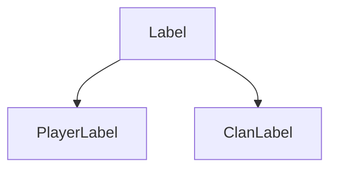
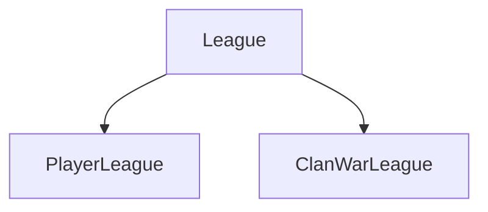

<p align="center">
    <a href="" alt="Python">
        
    </a>
    <br/>
    <a href="" alt="Status">
        
    </a>
    <a href="https://github.com/bim-ba/coc-api" alt="Contributions">
        
    </a>
</p>

<h1 align="center">coc-api</h1>
<p align="center"><a href="https://developer.clashofclans.com/#/documentation">Clash of Clans API</a> implemented via Python.

# Contents

* [Getting started](#getting-started)
    * [Requirements](#requirements)
    * [Installation](#installation)
* [Usage](#usage)
    * [Basic usage](#basic-usage)
* [General API Documentation](#general-api-documentation)
    * [Models](#models)
        * [Label](#label-model)
        * [League](#league-model)
        * [Location](#location-model)
        * [BadgeURLs](#badgeurls-model)
        * [Player](#player-model)
        * [PlayerLabel](#player-label-model)
        * [PlayerLeague](#player-league-model)
        * [PlayerAchievment](#player-achievment-model)
        * [PlayerTroop](#player-troop-model)
        * [Clan](#clan-model)
        * [ClanWar](#clan-war-model)
        * [ClanLabel](#clan-label-model)
        * [ClanWarInfo](#clan-war-info-model)
        * [ClanWarAttack](#clan-war-attack-model)
        * [ClanWarLeague](#clan-war-league-model)
        * [ClanWarPlayer](#clan-war-player-model)
        * [ClanWarResult](#clan-war-result-model)
        * [ClanWarInfoClan](#clan-war-info-clan-model)
        * [ClanChatLanguage](#clan-chat-language-model)
        * [GoldPass](#goldpass-model)
    * [Methods](#methods)
    * [Exceptions](#exceptions)
    * [Aliases](#aliases)
* [TODO](#todo)

# Getting started

This API is tested under _Python >=3.9_.

## Requirements

| Requirement | Version |
| :---------- | :------ |
| attrs | >=21.4.0 |
| cattrs | >=1.10.0 |
| aiohttp | >=3.8.1 |

## Installation

For now, you can install it only from source. This package will be available on PyPi
if code will be good, I think now it is only a raw version.

```shell
$ git clone https://github.com/bim-ba/coc-api.git
$ cd coc-api
$ pipenv install
```

# Usage

## Basic usage

```python
import asyncio
from client import Client

async def main():
    coc = Client('token') # your token

    clans = await coc.clans(name='bomb', location='ru', max_members=30)
    print(clans)
    # ['#2P8QU22L2', '#2PPYL9928', '#2PPYL9928', ...]

    clan = await coc.clan(clans[0])
    print(clan.name, clan.location)
    # bomb Location(id=32000193, isCountry=true, name='russia', countryCode='ru')

if __name__ == '__main__':
    asyncio.run(main())
```

# General API documentation

## Models

Models are similar to the original [Clash of Clans API Models](https://developer.clashofclans.com/#/documentation), **but with some changes**. I have made small changes to the design of these models (comparing them to the original ones) due to the fact that I have undertaken a slightly different design of these models in order to simplify and unify them.  
**In code all models are readonly, you cant change its contents - only read.**

<h3 id="label-model">Label</h3>

This model stores information about label id, name and [iconUrls](#badgeurls-model). This model is just a parent for [PlayerLabel](#player-label-model) and [ClanLabel](#clan-label-model). It will never be created directly.

| Field | Type | Description |
| :---- | :--: | :---------- |
| id | `str` | Field unique id |
| name | `str` | _lowercase_. Field unique name |
| iconUrls | [`BadgeURLs`](#badgeurls-model) \| `None` | _optional_. Field icons, some labels dont have icons. `None` if label does not have icons |



<h3 id="league-model">League</h3>

This model stores information about league id, its name and [iconUrls](#badgeurls-model). There are 2 types of leagues: [playerLeague](#player-league-model) and [clanLeague](#clan-league-model)

| Field | Type | Description |
| :---- | :--: | :---------- |
| id | `str` | Field unique id |
| name | `str` | _lowercase_. Field unique name |
| iconUrls | [`BadgeURLs`](#badgeurls-model) \| `None` | _optional_. Field icons, some leagues dont have icons. `None` if league does not have icons |



<h3 id="location-model">Location</h3>

This model stores information about location id, its name and country code. Location is not always a country (e.g. _International_), thats why `isCountry` field is exist and `countryCode` may be `None`.

| Field | Type | Description |
| :---- | :--: | :---------- |
| id | `int` | Location unique id |
| name | `str` | _lowercase_. Location unique name |
| isCountry | `bool` | `True` if location is country |
| countryCode | `str` \| `None` | _optional_. Location country code. `None` if location is not country |

<h3 id="badgeurls-model">BadgeURLs</h3>

This model stores information about small, medium and large image urls. Urls for some models may be missing, also a few models can have missing fields, thats why it is either `str` or `None`.

| Field | Type | Description |
| :---- | :--: | :---------- |
| small | `str` \| `None` | _optional_. Small icon url. `None` if missing |
| medium | `str` \| `None` | _optional_. Medium icon url. `None` if missing |
| large | `str` \| `None` | _optional_. Large icon url. `None` if missing |

<h3 id="player-model">Player</h3>

This model describes all information about player.

| Field | Type | Description |
| :---- | :--: | :---------- |
| tag | `str` | Player unique tag |
| name | `str` | Player name |
| townHallLevel | `int` | Player townhall level |
| builderHallLevel | `int` | Player builder hall level |
| expLevel | `int` | Player experience |
| trophies | `int` | Player trophies |
| bestTrophies | `int` | Player best trophies |
| warStars | `int` | Player summary war stars |
| attackWins | `int` | Player summary attack wins |
| defenseWins | `int` | Player summary defense wins |
| versusTrophies | `int` | Player versus trophies (builder base) |
| bestVersusTrophies | `int` | Player best versus trophies (builder base) |
| versusBattleWins | `int` | Player summary versus battle wins |
| donations | `int` | Player summary donations |
| donationsReceived | `int` | Player summary donations received |
| troops | <code>list[[`PlayerTroop`](#player-troop-model)]</code> | Player troops leveling |
| heroes | <code>list[[`PlayerTroop`](#player-troop-model)]</code> | Player heroes leveling |
| spells | <code>list[[`PlayerTroop`](#player-troop-model)]</code> | Player spells leveling |
| league | [`PlayerLeague`](#player-league-model) \| `None` | _optional_. Player league. `None` if player does not have league |
| clan | `str` | _optional_. Clan tag. It is not [Clan](#clan-model) due to recursion and object weight. `None` if player does not have clan |
| role | `'leader'` \| `'coLeader'` \| `'admin'` \| `'member'` \| `None` | _optional_. Player role in clan. `None` if player does not have clan |
| warPreference | `'in'` \| `'out'` \| `None` | _optional_. Player war preference. `None` if player does not specify it |
| townHallWeaponLevel | `int` \| `None` | _optional_. Player town hall weapon level (it is unlocked for player from 13 townhall level). `None` if player town hall is less than 13 |

<h3 id="player-label-model">PlayerLabel</h3>

This model describes player label information. Inherited from [Label](#label-model).

<h3 id="player-league-model">PlayerLeague</h3>

This model describes player league information. Inherited from [League](#league-model).

<h3 id="player-achievment-model">PlayerAchievment</h3>

This model describes information about some player achievment.

| Field | Type | Description |
| :---- | :--: | :---------- |
| name | `str` | Achievment name |
| stars | `int` | How many stars player have in this achievment |
| value | `int` | Progress |
| target | `int` | How much is needed to go to the next star |
| info | `str` | Detailed information about this achievment |
| village | `'home'` \| `'builderBase'` | In what village it achievment can obtained be |
| completionInfo | `str` \| `None` | _optional_. Completion info. `None` if ... |

<h3 id="player-troop-model">PlayerTroop</h3>

This model describes information about player troops (troops/spells/heroes). **This is not describes cuurent troops in player army camp, this describes troops leveling.**  
_Sometimes i think i should call it PlayerItem_

| Field | Type | Description |
| :---- | :--: | :---------- |
| name | `str` | Troop name |
| level | `int` | Troop level |
| maxLevel | `int` | Max troop level to which it can be upgraded |
| village | `'home'` \| `'builderBase'` | Which village this warrior belongs to |
| superTroopIsActive | `bool` \| `None` | _optional_. `True` if player activated _Super Troop Potion_. `None` if troop can not be _Super_ (spells and heroes can not be in _super form_) |

<h3 id="clan-model">Clan</h3>

This model describes all information about clan.

| Field | Type | Description |
| :---- | :--: | :---------- |
| tag | `str` | Clan unique tag |
| name | `str` | Clan name |
| type | `'open'` \| `'closed'` \| `'inviteOnly'` | Clan type |
| description | `str` | Clan description |
| badgeUrls | [`BadgeURLs`] | Clan icon urls |
| requiredTrophies | `int` | Required trophies to join this clan |
| requiredVersusTrophies | `int` | Required versus trophies (builder base) to join this clan |
| requiredTownhallLevel | `int` | Required town hall level to join this clan |
| labels | <code>list[[`ClanLabel`](#clan-label-model)]</code> | List of clan labels |
| clanLevel | `int` | Clan level |
| clanPoints | `int` | Clan points |
| clanVersusPoints | `int` | Clan versus points |
| memberList | `list[str]` | List of tags of clan members |
| war | [`ClanWar`](#clan-war-model) | Information about war |
| location | [`Location`](#location-model) \| `None` | _optional_. Information about clan location. `None` if clan did not specify it |
| chatLanguage | [`ClanChatLanguage`](#clan-chat-language-model) \| `None` | _optional_. Information about clan chat primary language. `None` if clan did not specify it |

<h3 id="clan-war-model">ClanWar</h3>

This model describes all summary information about clan war state. If `isWarLogPublic` is `False` you can not access current war information (including state) and war log.

| Field | Type | Description |
| :---- | :--: | :---------- |
| wins | `int` | How many times clan has won wars |
| losses | `int` | How many times clan has lost wars |
| ties | `int` | How many times clan has played a draw in wars |
| winstreak | `int` | War winstreak |
| isWarLogPublic | `bool` | `True` if clan war log is public |
| frequency | `always` \| `moreThanOncePerWeek` \| `oncePerWeek` \| `lessThanOncePerWeek` \| `never` \| `'unknown'` | Clan war frequency preference |
| state | [`ClanWarState`](#clan-war-state-model) \| `None` | Current war state. `None` if `self.isWarLogPublic` is `False` |
| currentwar | [`ClanWarInfo`](#clan-war-info-model) \| `None` | Information about current war. `None` if `self.isWarLogPublic` is `False` |
| log | [`ClanWarState`](#clan-war-state-model) \| `None` | War log. `None` if `self.isWarLogPublic` is `False` |

<h3 id="clan-label-model">ClanLabel</h3>

Clan label is clan label. See [Label](#label-model).

<h3 id="clan-war-info-model">ClanWarInfo</h3>

This model describes information about current war.

| Field | Type | Description |
| :---- | :--: | :---------- |
| clan | [`ClanWarInfoClan`](#clan-war-info-clan-model) | Current war information about this clan |
| opponent | [`ClanWarInfoClan`](#clan-war-info-clan-model) | Current war information about opponent clan |
| startTime | [`datetime.datetime`](https://docs.python.org/3/library/datetime.html#datetime-objects) \| `None` | _optional_. Current war start time (UTC). `None` if ...<br/>_pendulum may be good here_ |
| endTime | [`datetime.datetime`](https://docs.python.org/3/library/datetime.html#datetime-objects) \| `None` | _optional_. Current war end time (UTC). `None` if ...<br/>_pendulum may be good here_ |
| preparationStartTime | [`datetime.datetime`](https://docs.python.org/3/library/datetime.html#datetime-objects) \| `None` | _optional_. Current war preparation start time (UTC). `None` if ...<br/>_pendulum may be good here_ |
| teamSize | `int` \| `None` | _optional_. Clan team size in current war. `None` if ... |
| attacksPerMember | `int` \| `None` | _optional_. How many attacks one member can perform. `None` if ... |

<h3 id="clan-war-attack-model">ClanWarAttack</h3>

This model describes information about clan war attack. Every attack has attacker and defender, as for it, this model stores only attacker and defender tags, not full [Player](#player-model) because of recursion.

| Field | Type | Description |
| :---- | :--: | :---------- |
| attackerTag | `str` | Attacker tag |
| defenderTag | `str` | Defender tag |
| stars | `int` | How many stars attacker obtain |
| destructionPercentage | `float` | Destruction percentage in range 0.0 to 100% |
| order | `int` | Map position where attacked base is located |
| duration | [`datetime.timedelta`](https://docs.python.org/3/library/datetime.html#timedelta-objects) | How long did the attack last<br/>_pendulum may be good here_ |

<h3 id="clan-war-league-model">ClanWarLeague</h3>

Clan war league is war league of clan. See [League](#league-model).

<h3 id="clan-war-player-model">ClanWarPlayer</h3>

This model describes information about player in current clan war and his attacks (if made).

| Field | Type | Description |
| :---- | :--: | :---------- |
| tag | `str` | Player tag |
| mapPosition | `int` | Player map position |
| opponentAttacks | `int` | It seems to be `len(self.attacks)` |
| attacks | <code>list[[`ClanWarAttack`](#clan-war-attack-model)]</code> \| `None` | _optional_. Attacks against opponents. `None` if no were made |
| bestOpponentAttack | [`ClanWarAttack`](#clan-war-attack-model) \| `None` | _optional_. Best attack in `self.attacks`, based on stars and destruction percentage. `None` if no were made |

<h3 id="clan-war-result-model">ClanWarResult</h3>

This model describes result of clan war. Used in clan war logs.

| Field | Type | Description |
| :---- | :--: | :---------- |
| result | `'win'` \| `'lose'` \| `'tie'` | War result |
| endTime | [`datetime.datetime`](https://docs.python.org/3/library/datetime.html#datetime-objects) | When the war is ended (UTC).<br/>_pendulum may be good here_ |
| teamSize | `int` | War team size |
| attacksPerMember | `int` | How many attacks one member can perform |
| clan | [`ClanWarInfoClan`](#clan-war-info-clan-model) | War information about this clan |
| opponent | [`ClanWarInfoClan`](#clan-war-info-clan-model) | War information about opponent clan |

<h3 id="clan-war-info-clan-model">ClanWarInfoClan</h3>

This model describes information about some clan in war.

| Field | Type | Description |
| :---- | :--: | :---------- |
| clanLevel | `int` | Clan level |
| stars | `int` | Total stars received |
| destructionPercentage | `float` | Total destruction percentage |
| attacks | `int` \| `None` | _optional_. Total maded attacks. `None` if no were made |
| members | [`ClanWarPlayer`](#clan-war-player-model) \| `None` | _optional_. Participating clan members in war. `None` if there are no such |

<h3 id="clan-chat-language-model">ClanChatLanguage</h3>

Clan chat language stores information about primary clan chat language.

| Field | Type | Description |
| :---- | :--: | :---------- |
| id | `int` | Language unique id |
| name | `str` | _lowercase_. Language unique name |
| languageCode | `str` | _lowercase_. Language code (like country code) |

<h3 id="goldpass-model">GoldPass</h3>

This model describes information about current gold pass.

| Field | Type | Description |
| :---- | :--: | :---------- |
| startTime | [`datetime.datetime`](https://docs.python.org/3/library/datetime.html#datetime-objects) | Current season start time (UTC)<br/>_pendulum may be good here_ |
| endTime | [`datetime.datetime`](https://docs.python.org/3/library/datetime.html#datetime-objects) | Current season end time (UTC)<br/>_pendulum may be good here_ |

# TODO

- [ ] `tests.py`
- [ ] Testing under _Python <=3.9_
- [ ] Models fields must corresponds to _snake_case_ syntax
- [ ] Pendulum instead of standard datetime (is it worth it?)
- [ ] Comparable [Location](#location-model) and [ClanChatLanguage](#clan-chat-language-model)
- [ ] Comparable [Player](#player-model) and [ClanWarPlayer](#clan-war-player-model) 