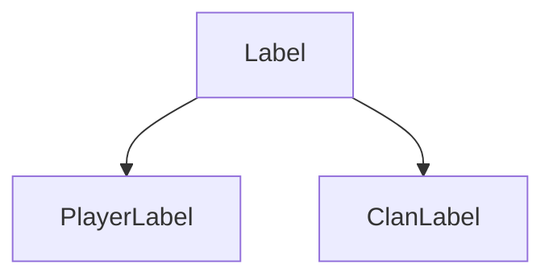
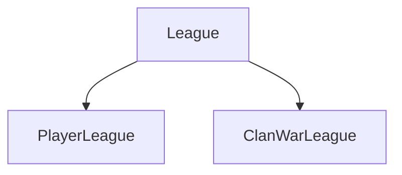

<p align="center">
    <a href="" alt="Status">
        
    </a>
    <a href="" alt="Python">
        
    </a>
</p>

# <p align="center"> coc-api
<p align="center"><a href="https://developer.clashofclans.com/#/documentation">Clash of Clans API</a> implemented via Python.

## Contents

* [Getting started](#getting-started)
    * [Requirements](#requirements)
    * [Installation](#installation)
* [Usage](#usage)
    * [Basic usage](#basic-usage)
* [General API Documentation](#general-api-documentation)
    * [Models](#models)
    * [Methods](#methods)
    * [Exceptions](#exceptions)
    * [Aliases](#aliases)

## Getting started

This API is tested with Python 3.9-3.10.
There is only one way to install this library:

### Requirements

|Requirement|Version|
|:-----------|-------:|
|attrs|21.4.0|
|cattrs|1.10.0|
|aiohttp|3.8.1|

### Installation

For now, you can install it only from source. This package will be available on PyPi
if code will be good, I think now it is only raw version with raw code.

```
$ git clone https://github.com/bim-ba/coc-api.git
$ cd coc-api
$ pip install -r requirements.txt
```

## Usage

### Basic usage

```python
import asyncio
from client import Client

async def main():
    token = '...' # your token
    coc = Client(token)

    clans = await coc.clans(name='bomb', location='ru', max_members=30)
    print(clans)
    # ['#2P8QU22L2', '#2PPYL9928', '#2PPYL9928', ...]

    clan = await coc.clan(clans[0])
    print(clan.name, clan.location)
    # bomb Location(id=32000193, isCountry=true, name='russia', countryCode='ru')

if __name__ == '__main__':
    asyncio.run(main())
```

## General API documentation

### Models

Models are similar to the original <a href="https://developer.clashofclans.com/#/documentation">Clash of Clans API Models</a>, **but with some changes**. There are some changes in these models due to the fact that I have undertaken a slightly different design of these models in order to simplify and unify them.

All models are immutable, you cant change its contents - only read.

**Changed models**: [Clan](#clan-model)

<h4 id="badgeurls-model">BadgeURLs</h4>

BadgeURLs is used to store small, medium and large image URLs. BadgeURLs for some models may be missing, also a few models can have missing fields. Thats why it is either `str` or `None`.

Fields:
```python
small: str | None
medium: str | None
large: str | None
```

<h4 id="label-model">Label</h4>

Label is used to store label id, its name and [iconUrls](#badgeurls-model). This model is just a parent for [PlayerLabel](#player-label-model) and [ClanLabel](#clan-label-model). It will never be created directly.

Fields:
```python
id: int
name: str
iconUrls: BadgeURLs | None
```

`name` always in lowercase.

`iconUrls` may be `None` because [ClanLabels](#clan-label-model) dont have icons.



<h4 id="league-model">League</h4>

League is used to store league id, its name and [iconUrls](#badgeurls-model). There are 2 types of leagues: [playerLeague](#player-league-model) and [clanLeague](#clan-league-model)

Fields:
```python
id: int
name: str # <- always in lowercase
iconUrls: BadgeURLs | None
```

`name` always in lowercase.

`iconUrls` may be `None` because some leagues dont have icons.



<h4 id="location-model">Location</h4>

Location is used to store location (really?)